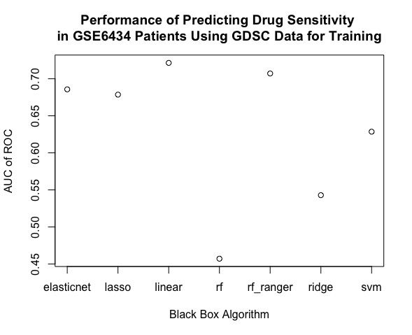
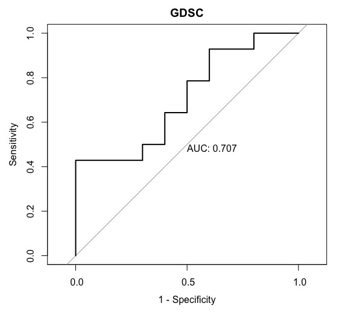
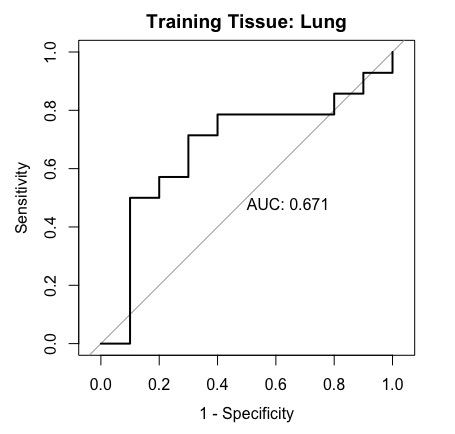
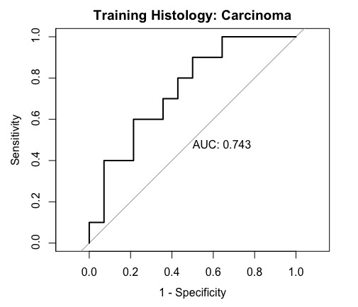

```{r setup, include = FALSE}
knitr::opts_chunk$set(
  collapse = TRUE,
  comment = "#>"
)
```

## Table of Contents
**[Introduction](#introduction)**<br>
**[Installation Instructions](#installation-instructions)**<br>

**[Usage Instructions](#usage-instructions)**<br>
**[1. Evaluating Different Options for a Specific Step of the FORESEE Pipeline (Here: Blackbox Algorithm)](#usage-instructions)**<br>
**[2. Comparing Modeling Performance of a Specific Pipeline on Different Data Sets](#usecase2)**<br>
**[3. Using Sample Information to Customize the Training Set](#usecase3)**<br>
**[4. Integrating User-Defined Functions into the FORESEE Pipeline](#usecase4)**<br>
 **[4.1. User-Defined CellResponseTransformation](#usecase4.1)**<br>
 **[4.2. User-Defined DuplicationHandling](#usecase4.2)**<br>
 **[4.3. User-Defined HomogenizationMethod](#usecase4.3)**<br>
 **[4.4. User-Defined GeneFilter](#usecase4.4)**<br>
 **[4.5. User-Defined FeaturePreprocessing](#usecase4.5)**<br>
 **[4.6. User-Defined BlackBox](#usecase4.6)**<br>


**[References](#references)**<br>

## Introduction {#introduction}

The uniFied translatiOnal dRug rESponsE prEdiction platform FORESEE is an R-package that is designed to act as a scaffold in developing and benchmarking predictive models that utilize drug sensitivity information gained in cell line models to predict clinical therapy outcome in patients. Besides introducing a uniform data format for public cell line and patient data sets, it incorporates state-of-the-art preprocessing methods, model training algorithms and different validation techniques to create a standardized environment for drug response prediction pipelines. 

The aim of this tutorial is to help users set up the FORESEE package and understand some of the routines that the package offers. While the reference manual that separately describes each of the functional modules and how to use them in great detail can be found at **!!!!!!!!!!LINK!!!!!!!!!!**, the use cases mentioned in this tutorial cover a more application-related context of the overall routine and exemplify how the user can exploit the capabilities of the implemented methods as well as how the scope of the package can be extended by user-defined functions and other packages.  


## Installation Instructions

**Be aware:** because of file size restrictions on github, FORESEE on github does not contain any data. 
If you want to install the full FORESEE package, first download the package via this link: 
https://osf.io/k3pg7/download
Or you can download directly in R:
```r
download.file(url = "https://osf.io/k3pg7/download", destfile = "FORESEE_0.9.9.tar.gz")
#You can change destination folder as you wish; here, we are downloading to the current folder
```
After downloading you can install the package by:
```r
install.packages("FORESEE_0.9.9.tar.gz", repos = NULL, type = "source")
```

## Use Cases

### 1. Evaluating Different Options for a Specific Step of the FORESEE Pipeline (Here: Blackbox Algorithm) {#usecase1}

In order to investigate those algorithms that are already implemented to train a drug response model, we can use the function *listInputOptions*.

```r
require(FORESEE)
algorithm_options <- listInputOptions("BlackBoxFilter")
```
Since we do not want to test a user-defined function for this use case, but only compare already implemented functions, we exclude that option from our list. 
```r
algorithm_options <- algorithm_options[algorithm_options != "User Defined Function"]
```
Moreover, we want to restrict our analysis to gene expression data only. Thus, we exclude the option *tandem* from our list, as it requires not only gene expression data, but at least one other molecular data type. 
```r
algorithm_options <- algorithm_options[algorithm_options != "tandem"]
```
In the next step, we can run the FORESEE pipeline, looping through the different options in our list. As an example, we use the cell line data set GDSC [@Garnett2012] for training the model and the breast cancer patient data set GSE6434 [@Chang2005] for testing the model.

```r
roc_auc <- c()

# Loop
for (i in 1:length(algorithm_options)){

# Train a model on GDSC cell line data
ForeseeTrain(
  TrainObject=GDSC, 
  TestObject=GSE6434, 
  DrugName="Docetaxel", 
  CellResponseType = "LN_IC50", 
  CellResponseTransformation = "none", 
  InputDataTypes = "GeneExpression", 
  TrainingTissue = "all", 
  TestingTissue = "all", 
  DuplicationHandling = "first", 
  HomogenizationMethod = "ComBat",
  GeneFilter = "variance", 
  FeaturePreprocessing = "none", 
  BlackBox = algorithm_options[i], 
  nfoldCrossvalidation = 1
)

# Test the model on GSE6434 patient data
ForeseeTest(
  TestObject=TestObject, 
  ForeseeModel=ForeseeModel, 
  Evaluation = "rocauc", 
  BlackBox = algorithm_options[i]
)

# Collect AUC of ROC as performance measure in a list
roc_auc[i] <-  Performance
}
```
In order to get an overview of the performances of the different algorithm options, we can plot the results in a diagram.

```r
# Plot the results
plot(roc_auc, xlab = "Black Box Algorithm", ylab = "AUC of ROC", xaxt='n',main="Performance of Predicting Drug Sensitivity \nin GSE6434 Patients Using GDSC Data for Training")
axis(1, at=1:7, labels=algorithm_options)
```




### 2. Comparing Modeling Performance of a Specific Pipeline on Different Data Sets {#usecase2}
In order to check for the performance stability of a model, it can be interesting to apply the same pipeline of preprocessing and processing methods to different data sets. Since both, the data set by Daemen et al. [@Daemen2013] and the GDSC data set [@Garnett2012], are well-known cell line data sets that contain data for Docetaxel, we chose these as separate training data sets to train our model. The resulting model is then tested on the breast cancer patient data set GSE6434 [@Chang2005]. 

We start with the GDSC data set, which includes the natural logarithms of IC50 values as drug sensitivity measure.

```r
require(FORESEE)
require(pROC)

ForeseeTrain(
  TrainObject=GDSC, 
  TestObject=GSE6434, 
  DrugName="Docetaxel", 
  CellResponseType = "LN_IC50",
  CellResponseTransformation = "none", 
  InputDataTypes = "GeneExpression", 
  TrainingTissue = "all",
  TestingTissue = "all", 
  DuplicationHandling = "first", 
  HomogenizationMethod = "ComBat",
  GeneFilter = "variance",
  FeaturePreprocessing = "none", 
  BlackBox = "rf_ranger", 
  nfoldCrossvalidation = 1
)

# Apply the trained model to patient data             
Foreseen<- Foreseer(
  TestObject=TestObject, 
  ForeseeModel=ForeseeModel, 
  BlackBox = "rf_ranger"
)
ROCObj_GDSC <- pROC::roc(-(as.numeric(TestObject$Annotation)), Foreseen, direction="<", auc=TRUE)
rocauc_GDSC <-ROCObj_GDSC$auc
```

Next, we use almost the same routine for the data set published by Daemen et al.. In order to investigate which drug sensitivity measures are available, we call: 

```r
DAEMEN$ResponseTypes
```
Since GI50 values are the only available response measure, we choose them for *CellResponseType* instead of IC50 values. 

```r

ForeseeTrain(
  TrainObject=DAEMEN, 
  TestObject=GSE6434, 
  DrugName="Docetaxel", 
  CellResponseType = "GI50",
  CellResponseTransformation = "none", 
  InputDataTypes = "GeneExpression", 
  TrainingTissue = "all",
  TestingTissue = "all", 
  DuplicationHandling = "first", 
  HomogenizationMethod = "ComBat",
  GeneFilter = "variance", 
  FeaturePreprocessing = "none", 
  BlackBox = "rf_ranger", 
  nfoldCrossvalidation = 1
)
             
# Apply the trained model to patient data 
Foreseen<- Foreseer(
  TestObject=TestObject, 
  ForeseeModel=ForeseeModel, 
  BlackBox = "rf_ranger"
)
ROCObj_DAEMEN <- pROC::roc(-(as.numeric(TestObject$Annotation)), Foreseen, direction="<", auc=TRUE)
rocauc_DAEMEN <-ROCObj_DAEMEN$auc

```
Plotting the corresponding ROC curves for both models, we see that for this specific set of parameters and methods, the model trained on GDSC data performs better than the model trained on the data by Daemen et al.. 

```r
plot.roc(ROCObj_GDSC, legacy.axes = TRUE, print.auc=TRUE, main = "GDSC")
plot.roc(ROCObj_DAEMEN, legacy.axes = TRUE, print.auc=TRUE, main = "Daemen et al.")

```




One possible cause for this significant difference in performance is the limited amount of samples in the training set by Daemen et al. (42 cell line samples with Docetaxel response) in comparison to the GDSC data set (836 cell line samples with Docetaxel response). Moreover, the overlap of features (genes) between training and test objects (after homogenization and variance filtering) is a lot larger for the combination of GDSC and GSE6434 (6347 genes) than for the combination of the data by Daemen et al. and GSE6434 (523 genes). A more detailed interpretation and explanation however is beyond the scope of this use case.

### 3. Using Sample Information to Customize the Training Set {#usecase3}

The functional element *SampleSelector* uses tissue site descriptions that are contained in the ForeseeCell object in order to restrict the training to samples with a certain tissue of origin, for example *lung*:

```r
require(FORESEE)
ForeseeTrain(
  TrainObject=GDSC, 
  TestObject=GSE6434, 
  DrugName="Docetaxel", 
  CellResponseType = "LN_IC50",
  CellResponseTransformation = "none", 
  InputDataTypes = "GeneExpression", 
  TrainingTissue = "lung",
  TestingTissue = "all", 
  DuplicationHandling = "first", 
  HomogenizationMethod = "ComBat",
  GeneFilter = "variance",
  FeaturePreprocessing = "none", 
  BlackBox = "linear", 
  nfoldCrossvalidation = 1
)

# Apply the trained model to patient data             
Foreseen<- Foreseer(
  TestObject=TestObject, 
  ForeseeModel=ForeseeModel, 
  BlackBox = "linear"
)
require(pROC)
ROCObj <- pROC::roc(-(as.numeric(TestObject$Annotation)), Foreseen)
plot.roc(ROCObj, legacy.axes = TRUE, print.auc=TRUE, main = "Training Tissue: Lung")

```


However, often there is more detailed information on the samples within the data files that remains unused, if only the *SampleSelector* is used for specification. This information can still be used, if users preprocesse the ForeseeCell Object before their analysis.

In order to get an overview of what information is available for the GDSC object, we can investigate the meta information:
```r
colnames(GDSC$TissueInfo)
```
Consequently, we can also filter the samples according to their Histology. In this example, we choose *carcinoma*:

```r
require(FORESEE)
GDSC_carcinoma <- GDSC

# Find all cell lines that are carcinomas
GDSC_carcinomacells <-GDSC$TissueInfo$Line[GDSC$TissueInfo$Histology=="carcinoma"]
# Restrict the GDSC_carcinoma object to those cell lines only
GDSC_carcinoma$GeneExpression <-GDSC_carcinoma$GeneExpression[,colnames(GDSC$GeneExpression) %in% GDSC_carcinomacells]
```
Now we can run the regular pipeline. We choose "all" for *TrainingTissue* to include all carcinoma samples we just collected:

```r
ForeseeTrain(
  TrainObject=GDSC_carcinoma, 
  TestObject=GSE6434, DrugName="Docetaxel", 
  CellResponseType = "LN_IC50",
  CellResponseTransformation = "none", 
  InputDataTypes = "GeneExpression", 
  TrainingTissue = "all",
  TestingTissue = "all", 
  DuplicationHandling = "first", 
  HomogenizationMethod = "ComBat",
  GeneFilter = "variance",
  FeaturePreprocessing = "none", 
  BlackBox = "linear", 
  nfoldCrossvalidation = 1
)

# Apply the trained model to patient data             
Foreseen<- Foreseer(
  TestObject=TestObject, 
  ForeseeModel=ForeseeModel, 
  BlackBox = "linear"
)
require(pROC)
ROCObj <- pROC::roc(-(as.numeric(TestObject$Annotation)), Foreseen)
plot.roc(ROCObj, legacy.axes = TRUE, print.auc=TRUE, main = "Training Histology: Carcinoma")

```



### 4. Integrating User-Defined Functions into the FORESEE Pipeline {#usecase4}
FORESEE is designed to be easily expandable. While there are numerous different pipelines already implemented in the package, the user can conveniently change each part of the pipeline with their own method. To be exact, within *ForeseeTrain*, *CellResponseTransformation*, *DuplicationHandling*,
*HomogenizationMethod*, *GeneFilter*, *FeaturePreprocessing* and *BlackBox* can be defined by the user. In this section we demonstrate this capability of FORESEE by some examples.

#### 4.1. User-Defined CellResponseTransformation: {#usecase4.1}
The underlying distribution of 'Response' has a great impact on the fitted model using a blackbox. Here, the 'Response' is the cell line response to a drug, quantified by different measures, such as IC50. The measured IC50s are not necessarily distributed for an optimum model fitiing, so it is quite common in the preprocessing stage to 'transform' these Response values, for example by power transformation or changing 
to logarithmic scale. These are already implemented in FORESEE and can be easily used by setting *CellResponseTransformation* to "powertransform" or to "logarithm" respectively.

However, it is also possible to implement your own transformation and pass your function in the form of
*CellResponseTransformation*=User_Transformation to be used in the FORESEE pipeline.

When implementing a function to be used in *CellResponseTransformation*, two points are important:

* FORESEE expects your transformation to be a function which has one vector of numerics as input and returns
another vector of numerics with the same length and order as the input.
* Input and output vectors need to have the same 'names'. In case your transformation removes the
'names' of the vector, you have to manually pass the 'names' from input vector to the output vector (See the next example).

As an example, we implement a new power transformation. Instead of the already implemented Box-Cox transformation,we use a Yeo-Johnson power transformation of the R-package caret [@caret] to be sure to avoid zeros or negative values in Response.
```r
YeoJohnsonTrans <- function(x){
    requireForesee(caret) # We use Yeo-Johnson power transformation implementation of caret package
    YeoJohnsonModel <- preProcess(x = as.data.frame(x), method = "YeoJohnson")
    YeoJohnsonTransformedX <- predict(object = YeoJohnsonModel, newdata = as.data.frame(x))$x
    names(YeoJohnsonTransformedX) <- names(x) #Make sure input and output has the same names and order.
    return(YeoJohnsonTransformedX)
}
```

Now we just have to pass YeoJohnsonTrans function to ForeseeTrain as the *CellResponseTransformation*:
```r
library(FORESEE)

ForeseeTrain(
  TrainObject = GDSC,
  TestObject = GSE6434,
  DrugName = "Docetaxel",
  DuplicationHandling = "first",
  GeneFilter = "variance",
  CellResponseType = "LN_IC50",
  CellResponseTransformation = YeoJohnsonTrans
)

ForeseeTest(
  TestObject = TestObject, 
  ForeseeModel = ForeseeModel
)
print(Performance)
```

From the comparison of the value of the Performance variable, it becomes apparent that the new Yeo-Johnson power transformation results in a slightly higher AUC of ROC than the already implemented Box-Cox powertransform.


#### 4.2. User-Defined DuplicationHandling: {#usecase4.2}
In case of having duplications within the features, such as the expression of the same gene measured by different probes, the user can personalize how FORESEE summarizes the multiple values for the same feature into one value.

FORESEE expects the function you pass to *DuplicationHandling* to get one vector of numerics as input, 
and returns one numerical value as output. There are numerous examples of these kinds of functions in R, such as mean, median, ...

*DuplicationHandling* is a cpu-intensive task. Thus, we recommend to pass a relatively fast function to 
*DuplicationHandling* in case you want to handle the duplications by your own implemented function.

Here are two examples showing how to pass functions to *DuplicationHandling*:

As the first example, we try to have the 'median' of the duplicated features as the summerized value:

```r
library(FORESEE)

ForeseeTrain(
  TrainObject = GDSC,
  TestObject = GSE6434,
  DrugName = "Docetaxel",
  GeneFilter = "variance",
  CellResponseType = "LN_IC50",
  CellResponseTransformation = "powertransform",
  DuplicationHandling = median
)

ForeseeTest(
  TestObject = TestObject, 
  ForeseeModel = ForeseeModel
)
print(Performance)
```

For the second example, we implement a function ourselves to handle duplications. We aim to use the 33% quantile as a summary of a group of duplicated features. We name our function 'Quan33' and implement it as:
```r
Quan33 <- function(x) quantile(x, probs = 0.33)
```

Now we can pass this function to *ForeseeTrain*:
```r
library(FORESEE)

ForeseeTrain(
  TrainObject = GDSC,
  TestObject = GSE6434,
  DrugName = "Docetaxel",
  GeneFilter = "variance",
  CellResponseType = "LN_IC50",
  CellResponseTransformation = "powertransform",
  DuplicationHandling = Quan33
)

ForeseeTest(
  TestObject = TestObject, 
  ForeseeModel = ForeseeModel
)
print(Performance)
```

#### 4.3. User-Defined HomogenizationMethod: {#usecase4.3}
Homogenization of train and test set is another part of FORESEE pipeline that can be fine tuned with a user-defined function. In case you want to make and use your own homogenization method, make sure that the function you pass to *ForeseeTrain* as *HomogenizationMethod* satisfies the following three conditions:

* FORESEE expects your homogenization to be a function with two matrices as inputs and a list as output.
* The list returned as the output should have a length of two, containing two matrices, which are the homogenized versions of the input matrices with the same order.
* Make sure that the homogenized output matrices have the same dimnames as input matrices. In case the homogenization function drops dimension names, they have to be passed to the output manually.

As an example, we implement the batch effects removal of the 'ber' package as HomogenizationMethod [@ber].
First, we implement a function that uses 'ber' to remove batches and is in concordance to the points we mentioned above:
```r
BER <- function(MAT1,MAT2){
  requireForesee(ber)
  batches <- as.factor(c(rep("MAT1",ncol(MAT1)),rep("MAT2",ncol(MAT2))))
  homogenizedData <- ber(Y = t(cbind(MAT1,MAT2)), b = batches)
  return(list(t(homogenizedData[c(1:ncol(MAT1)),]), t(homogenizedData[-c(1:ncol(MAT1)),])))
}
```

Now we can test the homogenization method inside a FOERSEE pipeline:
```r
library(FORESEE)

ForeseeTrain(
  TrainObject = GDSC,
  TestObject = GSE6434,
  DrugName = "Docetaxel",
  GeneFilter = "variance",
  CellResponseType = "LN_IC50",
  CellResponseTransformation = "powertransform",
  DuplicationHandling = "first",
  HomogenizationMethod = BER
)

ForeseeTest(
  TestObject = TestObject, 
  ForeseeModel = ForeseeModel
)
print(Performance)
```

#### 4.4. User-Defined GeneFilter: {#usecase4.4}
There are two main ways for the user to manipulate how genes are filtered and which genes are used in FORESEE pipeline:

The first way is inspired by the already implemented 'variance' option of *GeneFilter*, where based on the variance of genes, 20 percent of the lowest variant genes are discarded, while the remaining genes are used for the model. When the user passes a function to *GeneFilter*, the same method is used but instead of taking the variance as desired measure, the user-defined function determines the filter. As an example, the following example shows how 20 percent of the genes with the lowest median absolute deviation can be filtered out:
```r
library(FORESEE)

ForeseeTrain(
  TrainObject = GDSC,
  TestObject = GSE6434,
  DrugName = "Docetaxel",
  CellResponseType = "LN_IC50",
  CellResponseTransformation = "powertransform",
  DuplicationHandling = "first",
  GeneFilter = mad
)
  
ForeseeTest(
  TestObject = TestObject, 
  ForeseeModel = ForeseeModel
)
print(Performance)
```
As mentioned above, the function passed to *GeneFilter* has to have a vector of numerics as input and one numeric value as output.

The second way for a user to manipulate gene filtering is to directly remove the unwanted genes from ForeseeTrain objects. This way is particularly useful if the user has a specific list of genes to be used only. In the next example we show how a user-specific list of genes can be used as *GeneFilter*:
```r
library(FORESEE)

GenesToUse <- c("2207","28962","3373","5655","51296","23066","80821","51101","145447","84262", "6812","51136","26494","60506","7593","90864","387911","55125","84542","55153")

GDSCFiltered <- GDSC
GDSCFiltered$GeneExpression <-     GDSCFiltered$GeneExpression[match(GenesToUse,rownames(GDSCFiltered$GeneExpression)),]

ForeseeTrain(
  TrainObject = GDSCFiltered,
  TestObject = GSE6434,
  DrugName = "Docetaxel",
  CellResponseType = "LN_IC50",
  CellResponseTransformation = "powertransform",
  DuplicationHandling = "first",
  GeneFilter = "all"
)

ForeseeTest(
  TestObject = TestObject, 
  ForeseeModel = ForeseeModel
)
print(Performance)
```

#### 4.5. User-Defined FeaturePreprocessing: {#usecase4.5}
Users can define and use their own *FeaturePreprocessing* function in FORESEE. *FeaturePreprocessing* is a function that is applied to the GeneExpression matrix of both, the train and the test object in *ForeseeTrain*. It accepts a matrix of numerical values as input and returns the processed version of the input matrix. In case the processing function drops dimension names, they have to be passed to the output manually.

As an example, we implement a function which transforms all eigenvalues of a matrix to 1, and use this function as feature preprocessor in *ForeseeTrain*:
```r
equalizer <- function(MAT){
  MATsvd <- svd(MAT)
  MATprocessed <- MATsvd$u %*% diag(length(MATsvd$d)) %*% t(MATsvd$v)
  dimnames(MATprocessed) <- dimnames(MAT)
  return(MATprocessed)
}
```

```r
library(FORESEE)

ForeseeTrain(
  TrainObject = GDSC,
  TestObject = GSE6434,
  DrugName = "Docetaxel",
  CellResponseType = "LN_IC50",
  CellResponseTransformation = "powertransform",
  DuplicationHandling = "first",
  GeneFilter = "variance",
  FeaturePreprocessing = equalizer
)
                                                
ForeseeTest(TestObject = TestObject, ForeseeModel = ForeseeModel)
print(Performance)
```

#### 4.6. User-Defined BlackBox: {#usecase4.6}
Users can use their own model in data fitting by passing a function to the *BlackBox* input in ForeseeTrain. The function passed to *BlackBox*:

* is expected to be a function that trains a model.
* needs to have two inputs: first a formula of the model to be fit, and second a data frame containing the data to be used in fitting the model.
* returns a model that can be used to predict the output for new data.

When a user-defined function is used for *BlackBox* in ForeseeTrain, mthe corresponding 'predict' function needs to be passed to the *BlackBox* input of *ForeseeTest* as well. The 'predict' function is expected to have two inputs - the fitted model and the new data frame containing new data for prediction - and one output vector containing the predicted values.

As an example we show how to use the Gaussian process from the R-package caret as model for *BlackBox* [@caret].
First, we write a wrapper function around the train function of the caret package, such that it only has two inputs (as ForeseeTrain *BlackBox* expects):

```r
GaussianWrapper <- function(FORMULA, DATA){
  requireForesee(caret)
  train(FORMULA, data = DATA, method = "gaussprLinear")
}
```

Now we can pass GaussianWrapper as *BlackBox* in ForeseeTrain. Since we used the 'gaussprLinear' method of caret, our model is an object of the class 'train'. Therefore,  we need to pass 'caret::predict.train' as the *BlackBox* option in ForeseeTest. However, as the R-package caret is attached, we can simply pass 'predict' as the *BlackBox* option. In this case, R will automatically dispatch the caret::predict.train function:

```r
library(FORESEE)

ForeseeTrain(
  TrainObject = GDSC,
  TestObject = GSE6434,
  DrugName = "Docetaxel",
  CellResponseType = "LN_IC50",
  CellResponseTransformation = "powertransform",
  DuplicationHandling = "first",
  GeneFilter = "variance",
  BlackBox = GaussianWrapper
)
                                                
ForeseeTest(
  TestObject = TestObject, 
  ForeseeModel = ForeseeModel, 
  BlackBox = predict
)
print(Performance)
```

## References {#references}

